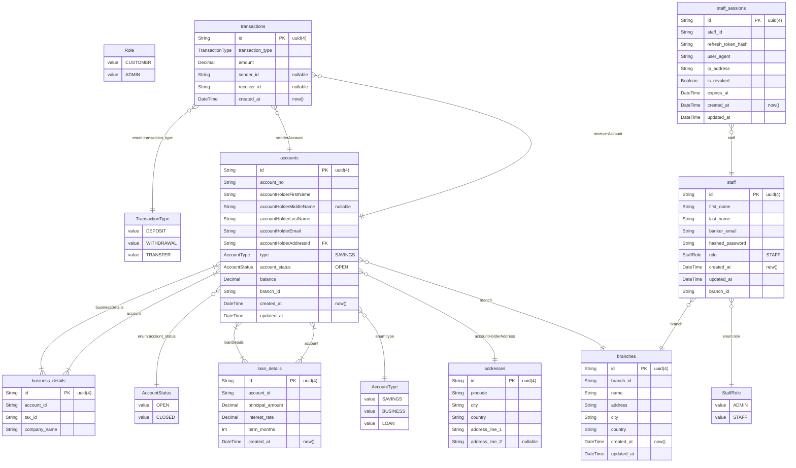

```mermaid
erDiagram
	Role {
		value CUSTOMER
		value ADMIN
	}
	StaffRole {
		value ADMIN
		value STAFF
	}
	TransactionType {
		value DEPOSIT
		value WITHDRAWAL
		value TRANSFER
	}
	AccountType {
		value SAVINGS
		value BUSINESS
		value LOAN
	}
	AccountStatus {
		value OPEN
		value CLOSED
	}
	addresses {
		String id PK  "uuid(4)"
		String pincode
		String city
		String country
		String address_line_1
		String address_line_2  "nullable"
	}
	accounts {
		String id PK  "uuid(4)"
		String account_no
		String accountHolderFirstName
		String accountHolderMiddleName  "nullable"
		String accountHolderLastName
		String accountHolderEmail
		String accountHolderAddressId FK
		AccountType type "SAVINGS"
		AccountStatus account_status "OPEN"
		Decimal balance
		String branch_id
		DateTime created_at  "now()"
		DateTime updated_at
	}
	loan_details {
		String id PK  "uuid(4)"
		String account_id
		Decimal principal_amount
		Decimal interest_rate
		Int term_months
		DateTime created_at  "now()"
	}
	business_details {
		String id PK  "uuid(4)"
		String account_id
		String tax_id
		String company_name
	}
	transactions {
		String id PK  "uuid(4)"
		TransactionType transaction_type
		Decimal amount
		String sender_id  "nullable"
		String receiver_id  "nullable"
		DateTime created_at  "now()"
	}
	staff {
		String id PK  "uuid(4)"
		String first_name
		String last_name
		String banker_email
		String hashed_password
		StaffRole role "STAFF"
		DateTime created_at  "now()"
		DateTime updated_at
		String branch_id
	}
	staff_sessions {
		String id PK  "uuid(4)"
		String staff_id
		String refresh_token_hash
		String user_agent
		String ip_address
		Boolean is_revoked
		DateTime expires_at
		DateTime created_at  "now()"
		DateTime updated_at
	}
	branches {
		String id PK  "uuid(4)"
		String branch_id
		String name
		String address
		String city
		String country
		DateTime created_at  "now()"
		DateTime updated_at
	}
	accounts }o--|| addresses : accountHolderAddress
	accounts }o--|| branches : branch
	accounts }|--|{ loan_details : loanDetails
	accounts }|--|{ business_details : businessDetails
	accounts }o--|| AccountType : "enum:type"
	accounts }o--|| AccountStatus : "enum:account_status"
	loan_details }|--|{ accounts : account
	business_details }|--|{ accounts : account
	transactions }o--|| accounts : senderAccount
	transactions }o--|| accounts : receiverAccount
	transactions }o--|| TransactionType : "enum:transaction_type"
	staff }o--|| branches : branch
	staff }o--|| StaffRole : "enum:role"
	staff_sessions }o--|| staff : staff

```
